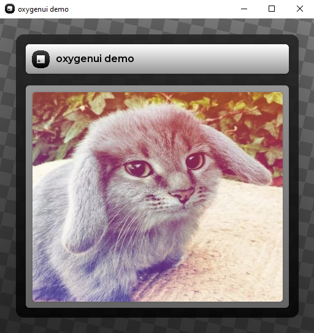
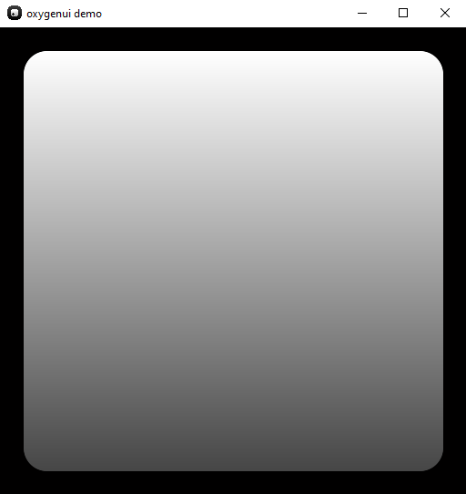

# oxygenui
### [ english ](../README.md)
простая и понятная GUI библиотека, которая привносит опыт верстки CSS/Roblox Studio в разработку на C++



_ __
## подробнее
oxygenui - это небольшая прослойка между SFML и разработчиком, которая позволяет делать красивые и современные GUI (Graphical User Interface)
за считанные минуты, даже без глубоких познаний в C++.
### например
> маленький кусок library-specific кода
<table>
  <tr>
    <td></td>
    <td><pre><code class="language-cpp">
auto thing = uiobject::create();
thing->pos = { 0, 0, 0, 0 };
thing->size = { 1, 0, 1, 0 };
thing->roundness = 0.1;
thing->padding = 0.1;

auto white = std::make_shared<color>();
white->content = sf::Color(255, 255, 255);
white->position = 0.0f;

auto gray = std::make_shared<color>();
gray->content = sf::Color(70, 70, 70);
gray->position = 1.0f;

thing->background_color.content.push_back(white);
thing->background_color.content.push_back(gray);

sort();
    </td>
  </tr>
</table>

_ __

## еще подробнее
<br/> oxygenui объединяет в себе лучшие черты CSS и верстки UI в Roblox Studio, а именно:
<br>
 - flexbox из CSS
 - систему позиционирования как в Roblox Studio
 - nested-архитектуру (каждый объект зависит от своего родителя)
 - широкую кастомизацию (чем GTK / Qt похвастаться не может \:) )
 - объектно ориентированную верстку как в Roblox Studio
 - (частично) систему измерений из Roblox Studio

к тому же oxygenui имеет в себе некоторые другие фишки:
<br>
- опору на относительные единицы измерения, а не абсолютные
- встроенный функционал бесконечных фонов
- аппаратное ускорение
- (наверное) удобный графический конвеер
- полную кроссплатформенность
- легкий синтаксис и простую архетиктуру
- независимость от стандартных графических window-форм, полная творчесская свобода

 > под опорой на относительные единицы измерения имеется в виду то, что большая часть значений property у объектов являются относительными той, или иной оси размера родителя.
 <br> например, отступ объекта от границ своего родителя (padding), вычесляется относительно его padding_dominant_axis. 
 _ __
## как оно работает
по подробнее о том, как вычисляется и на что влияет каждый property написано в [Wiki](ruwiki.md)
_ __
## установка
### 1. установка SFML 2.6.1
т.к **oxygenui** это прослойка между SFML и жиром за экраном, для работы oxyui нужна SFML (ИМЕННО 2.6.1!!!!, потом мб обновлю код)
* **windows (vcpkg)**
  ```json
      {
        "name": "test",
        "version-string": "0.1.0",
        "dependencies": [
            "sfml"
        ],
        "overrides": [
            {
                "name": "sfml",
                "version": "2.6.1"
            }
        ],
        "builtin-baseline": "d015e31e90838a4c9dfa3eed45979bc70d9357fc"
    }
  ```
 * **windows (cmd)**
  ```bash
  vcpkg install sfml:x64-windows
  ```

* **ubuntu / debian / mint**
  ```bash
  sudo apt-get update
  sudo apt-get install libsfml-dev=2.6.1*
  ```
* **fedora / rhel**
  ```bash
  sudo dnf install SFML-devel-2.6.1
  ```

* **mac**
  <br>тут тебе даже господь не поможет (на самом деле мне лень расписывать, сам в гугле найдешь)
### 2. установка **oxygenui**
1. скачай последний релиз библиотеки в [Releases](github.com) (oxygenui-lib.7z / .zip)
1. распакуй в папку с исходным кодом (как-нибудь по типу ``src/libs/oxygenui-lib``)

<br>
на этом все, теперь достаточно ее просто за инклудить в коде

_ __
## лицензия

Этот проект распространяется под свободной разрешительной лицензией **MIT** — вы можете свободно использовать, модифицировать и продавать этот код в любых (в том числе коммерческих) проектах. Единственное условие — сохранение уведомления об авторстве. Подробнее см. в файле [LICENSE](../LICENSE).

### сторонние лицензии
**oxygenui** использует следующие библиотеки:
* **SFML** — Распространяется под лицензией [zlib/libpng license](https://github.com/SFML/SFML).

Все используемые сторонние лицензии являются разрешительными и **полностью совместимы** с лицензией MIT.